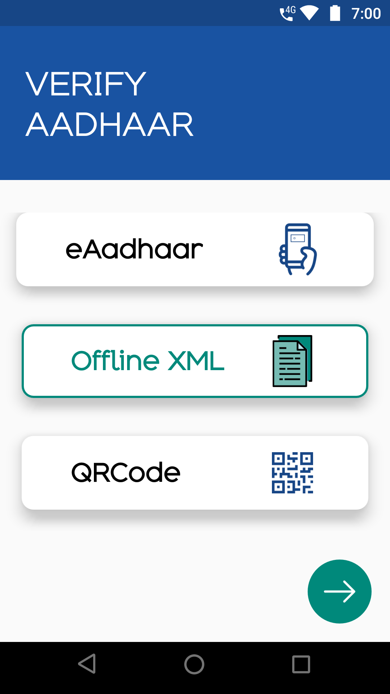
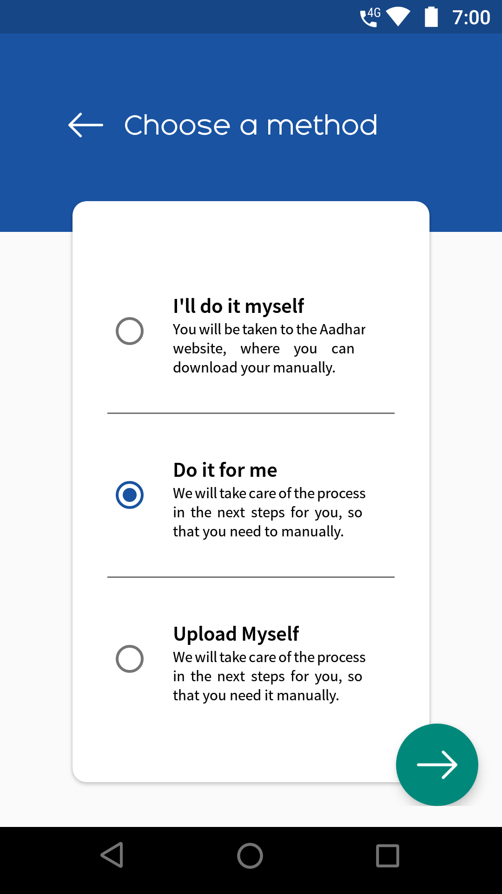
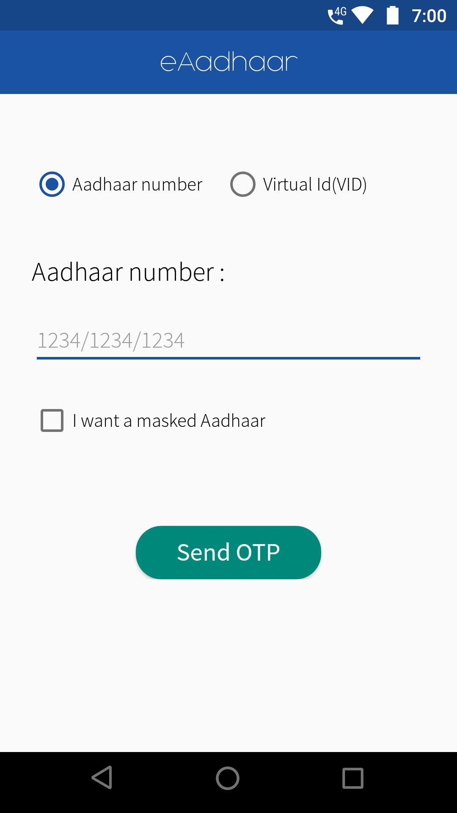
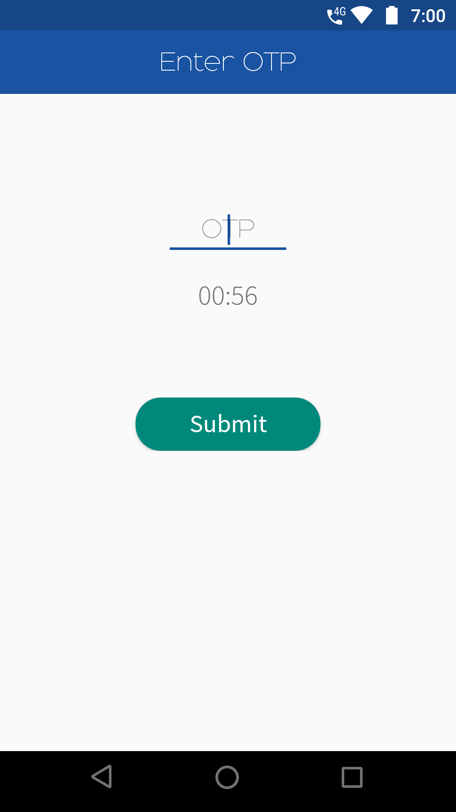
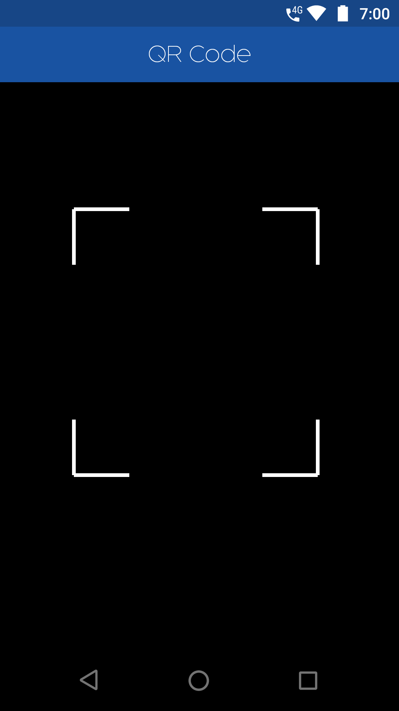

# SurePass Android SDK

## Table of contents

* [Overview](#overview)
* [Getting started](#getting-started)
* [Handling callbacks](#handling-callbacks)
* [Customising SDK](#customising-sdk)
* [Creating checks](#creating-checks)
* [Going live](#going-live)
* [Cross platform frameworks](#cross-platform-frameworks)
* [Migrating](#migrating)
* [Getting notified about releases](#getting-notified-about-releases)
* [Licensing](#licensing)
* [More information](#more-information)

## Overview

This SDK provides a drop-in set of screens and tools for Android applications to allow Verification of Aadhaar card via a no. of methods for the purpose of identity verification. The SDK offers a number of benefits to help you create the best onboarding/identity verification experience for your customers:

- Carefully designed UI to guide your customers through the entire Aadhaar verification process
- Modular design to help you seamlessly integrate the Aadhaar verification process into your application flow
- Advanced api to ensure the process of Aadhaar verification to be simple, guaranteeing the best success rate
- Direct get data to the integrating app/module, to simplify integration\*

\* Note: the SDK is only responsible for providing interfaces to different verification techniques. You still need to access the [SurePass API](https://documentation.onfido.com/) to create and manage checks.

